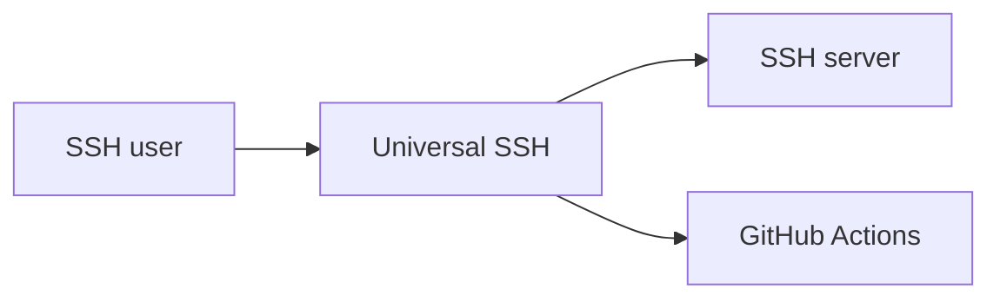
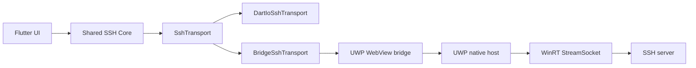
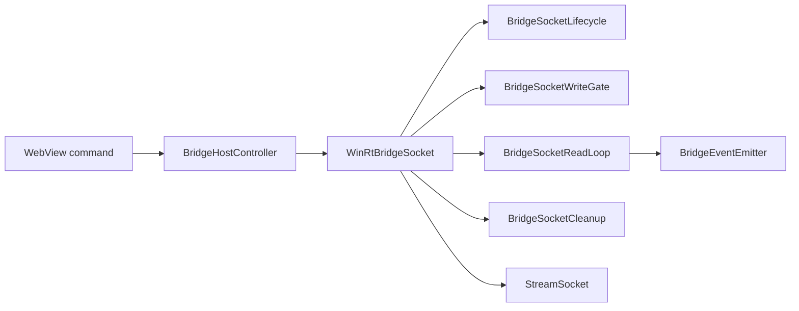
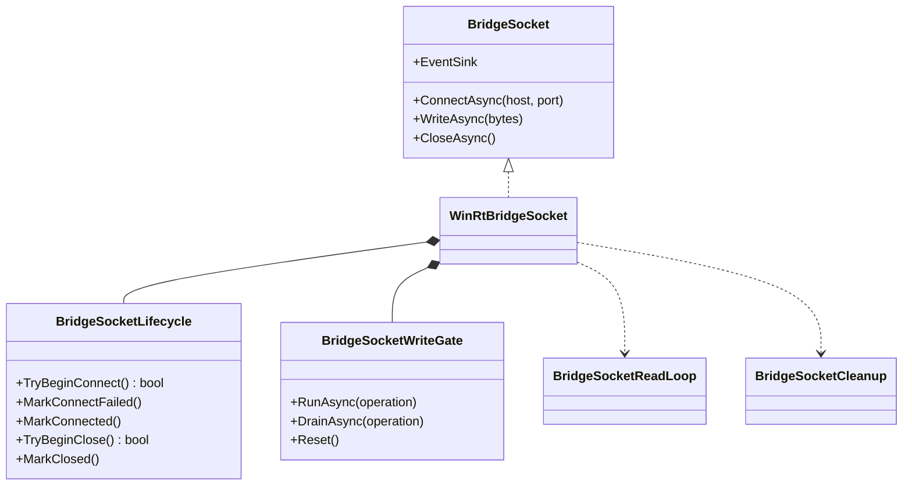

# Universal SSH

**Universal SSH** é um projeto open source de cliente SSH multiplataforma construído com **Flutter e Dart**, projetado para compartilhar o máximo possível de código entre **Web/PWA, Android, Windows x64 e Xbox One**.

> **Estado atual:** núcleo de transporte SSH e bridge UWP em desenvolvimento incremental, com TDD, CI/CD multiplataforma e documentação arquitetural executável.

## Objetivo

O projeto busca oferecer uma experiência de terminal remoto consistente em dispositivos com capacidades muito diferentes, desde navegadores e celulares Android até PCs Windows e o Xbox One original.

O Xbox One é tratado como plataforma restritiva de referência. Em vez de espalhar verificações específicas de sistema operacional pelo aplicativo, recursos como rede, armazenamento seguro, teclado, gamepad, clipboard e arquivos são abstraídos por capabilities e adapters de plataforma.

## Flutter multiplatform, Dart-first

Este **não é um projeto Dart puro**. A aplicação é **Flutter multiplatform**, enquanto Dart é a linguagem e o núcleo compartilhado.

A regra arquitetural é manter em Dart puro tudo que não depende diretamente da interface gráfica ou do sistema operacional. Flutter fornece UI e runtime compartilhados. Código nativo existe somente quando uma capability não pode ser implementada adequadamente pelo ambiente Flutter/Web.

```text
                    Universal SSH
                          |
                    Flutter / Dart
                          |
              Application / Domain
                          |
                 Platform Services
                          |
          +---------------+---------------+
          |               |               |
         Web           Android          UWP x64
          |               |               |
     Browser APIs    Android APIs     WinRT / UWP
                                          |
                                      Windows x64
                                      Xbox One
```

### Responsabilidades do núcleo Dart

- modelos de conexão e regras de domínio;
- estado das sessões;
- parser e representação do terminal;
- histórico e comandos favoritos;
- serialização e protocolo da bridge;
- abstrações de transporte e capabilities;
- testes independentes das APIs de plataforma.

### Responsabilidades específicas de plataforma

- sockets e transporte de rede;
- armazenamento seguro de credenciais;
- integração com sistema de arquivos;
- gamepad, teclado e clipboard;
- APIs específicas do Windows/UWP ou Android.

## Plataformas e targets

| Target | Runtime | Estratégia |
| --- | --- | --- |
| Web | Navegadores / PWA | Flutter Web |
| Android | Android | Flutter Android |
| UWP x64 | Windows x64 | Host UWP + Flutter Web em WebView |
| UWP x64 | Xbox One | Mesmo host UWP x64 + Flutter Web em WebView |

Flutter não possui um target UWP/Xbox neste projeto. Windows x64/Xbox utilizam um **host UWP customizado**. Esse target não é equivalente a `flutter build windows`: o host C#/WinRT incorpora o artifact produzido por `flutter build web` e o apresenta em um WebView.

## Arquitetura — C4

Os quatro níveis C4 abaixo são renderizados diretamente pelo GitHub e representam a arquitetura versionada do projeto. O catálogo detalhado é mantido em [docs/architecture](docs/architecture/README.md), incluindo os **4 níveis C4** e os **14 tipos de diagramas UML 2.x** representados com a notação Mermaid mais próxima disponível.

### C4 — Level 1: System Context



### C4 — Level 2: Containers



### C4 — Level 3: Components — UWP transport



### C4 — Level 4: Code



### UML 2.x e documentação completa

Os **14 tipos UML** estão em [docs/architecture/uml.md](docs/architecture/uml.md), enquanto a definição canônica dos quatro níveis acima está em [docs/architecture/c4.md](docs/architecture/c4.md). O Architecture Gate do GitHub Actions exige o catálogo de 18 diagramas e renderiza cada bloco Mermaid antes que uma alteração arquitetural seja considerada válida.

## Capability-oriented design

O domínio não deve depender de verificações espalhadas como `if (xbox)` ou `if (android)`. A intenção é expor interfaces semânticas para capabilities e transporte.

```dart
abstract interface class PlatformCapabilities {
  bool get rawTcp;
  bool get gamepad;
  bool get physicalKeyboard;
  bool get pointer;
  bool get touch;
  bool get secureStorage;
  bool get fileSystem;
  bool get clipboard;
}
```

Da mesma forma, o transporte SSH deve ser independente da tecnologia usada para alcançar o servidor:

```dart
abstract interface class SshTransport {
  Future<void> connect(ConnectionConfig config);
  Stream<List<int>> get incoming;
  Future<void> send(List<int> data);
  Future<void> close();
}
```

Isso permite usar transporte nativo onde sockets estão disponíveis e uma estratégia WebSocket/gateway no navegador sem alterar as regras de domínio.

## UX: gamepad, teclado, touch e mouse

A UI será orientada por **ações semânticas**, não por botões físicos específicos. O Xbox estabelece o caso gamepad-first, mas a mesma abstração poderá funcionar com controles conectados ao Android, Windows ou navegador.

O terminal terá um modo de interação próprio para que setas, Tab, Ctrl+C, Ctrl+D e Ctrl+L sejam encaminhados à sessão remota sem conflitar com a navegação da aplicação.

## Estrutura atual

```text
universal-ssh/
├── .github/workflows/build.yml
├── lib/main.dart
├── test/widget_test.dart
├── uwp/
│   ├── UniversalSshUwp.sln
│   └── UniversalSshUwp/
│       ├── App.xaml
│       ├── MainPage.xaml
│       ├── Package.appxmanifest
│       └── UniversalSshUwp.csproj
├── analysis_options.yaml
├── pubspec.yaml
└── README.md
```

Os scaffolds oficiais de `android/` e `web/` são atualmente gerados pelo Flutter durante o CI. Isso mantém esses targets alinhados ao template da versão Flutter utilizada pelo pipeline enquanto a arquitetura inicial é estabilizada.

## CI/CD

O workflow principal está em `.github/workflows/build.yml`.

```text
                         commit
                            |
                     GitHub Actions
                            |
              +-------------+-------------+
              |                           |
         build-web                  build-android
              |                           |
      analyze + test                     APK
              |
      flutter build web
              |
       artifact flutter-web
              |
              v
        build-uwp-x64
              |
       embed Web artifact
              |
          MSBuild x64
              |
         APPX / MSIX
```

A dependência `build-web -> build-uwp-x64` é intencional: UWP deve empacotar o **mesmo artifact Web produzido e validado pelo job Web**, e não realizar silenciosamente outro build do frontend.

A rastreabilidade pretendida é:

```text
commit SHA
 -> workflow run
 -> job
 -> step
 -> log
 -> artifact
 -> artifact digest
 -> package/release
```

A assinatura do pacote UWP não pertence ao baseline de CI. Ela deverá ser adicionada posteriormente em um estágio de release protegido, com certificados e segredos apropriados.

## Desenvolvimento local

```sh
flutter create --platforms=android,web --project-name universal_ssh .
flutter pub get
flutter analyze
flutter test
```

Build Web: `flutter build web --release`.

Build Android: `flutter build apk --release`.

O UWP requer ambiente Windows com toolchain MSBuild/UWP compatível e utiliza `uwp/UniversalSshUwp.sln`.

## Roadmap técnico

1. validar Web e Android no CI;
2. validar empacotamento UWP x64;
3. validar execução do host em Windows;
4. validar o mesmo host/pacote no Xbox One em Developer Mode;
5. estabilizar a bridge Dart/JavaScript ↔ UWP;
6. introduzir `PlatformCapabilities`;
7. implementar transporte e sessões SSH;
8. adicionar gamepad, teclado e terminal;
9. adicionar armazenamento seguro;
10. criar pipeline de assinatura e releases.

Cada capability deve entrar isoladamente e com testes, preservando uma cadeia de build reproduzível.

## Licença

O projeto é distribuído sob a licença **MIT**. Consulte [LICENSE](LICENSE).
