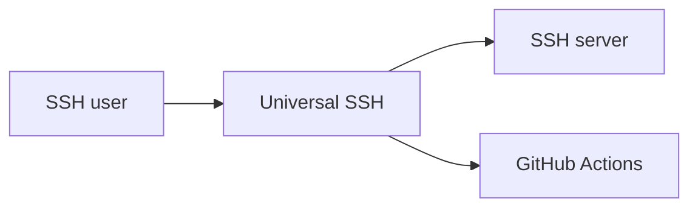
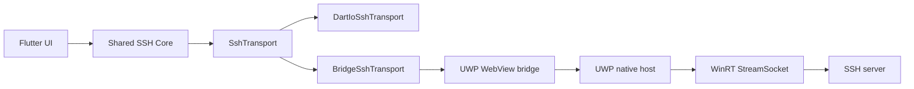
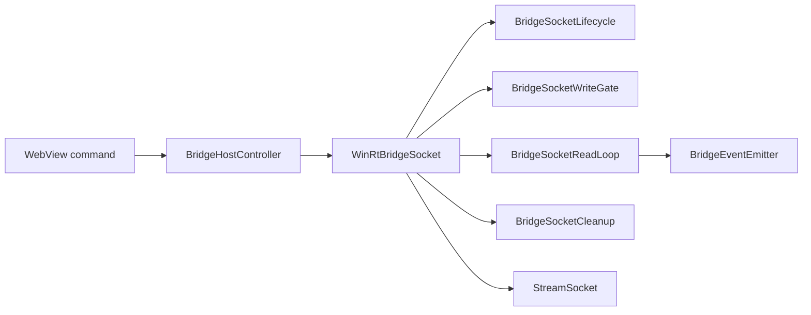
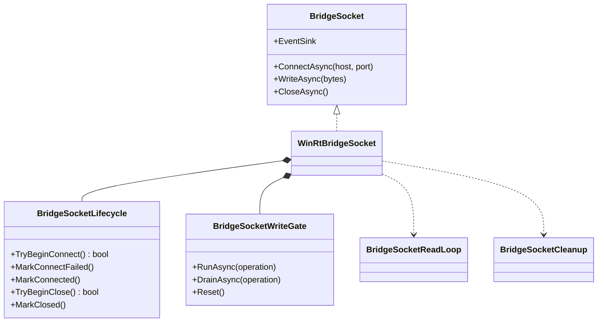

# C4 model

## Level 1 — System Context

```mermaid
flowchart LR
  User[SSH user] --> USS[Universal SSH]
  USS --> Host[SSH server]
  USS --> GH[GitHub Actions]
```

## Level 2 — Containers

```mermaid
flowchart LR
  UI[Flutter UI] --> Core[Shared SSH Core]
  Core --> T[SshTransport]
  T --> IO[DartIoSshTransport]
  T --> BT[BridgeSshTransport]
  BT --> WV[UWP WebView bridge]
  WV --> Host[UWP native host]
  Host --> TCP[WinRT StreamSocket]
  TCP --> SSH[SSH server]
```

## Level 3 — Components: UWP transport

```mermaid
flowchart LR
  JS[WebView command] --> HC[BridgeHostController]
  HC --> BS[WinRtBridgeSocket]
  BS --> LC[BridgeSocketLifecycle]
  BS --> WG[BridgeSocketWriteGate]
  BS --> RL[BridgeSocketReadLoop]
  BS --> CL[BridgeSocketCleanup]
  RL --> EM[BridgeEventEmitter]
  BS --> SS[StreamSocket]
```

## Level 4 — Code

```mermaid
classDiagram
  class BridgeSocket {
    +EventSink
    +ConnectAsync(host, port)
    +WriteAsync(bytes)
    +CloseAsync()
  }
  class WinRtBridgeSocket
  class BridgeSocketLifecycle {
    +TryBeginConnect() bool
    +MarkConnectFailed()
    +MarkConnected()
    +TryBeginClose() bool
    +MarkClosed()
  }
  class BridgeSocketWriteGate {
    +RunAsync(operation)
    +DrainAsync(operation)
    +Reset()
  }
  class BridgeSocketReadLoop
  class BridgeSocketCleanup
  BridgeSocket <|.. WinRtBridgeSocket
  WinRtBridgeSocket *-- BridgeSocketLifecycle
  WinRtBridgeSocket *-- BridgeSocketWriteGate
  WinRtBridgeSocket ..> BridgeSocketReadLoop
  WinRtBridgeSocket ..> BridgeSocketCleanup
```
