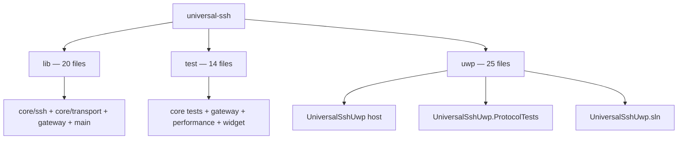

# Repository file traceability

This inventory complements the semantic C4/UML architecture. It is intentionally physical: every tracked file under `lib/`, `test/`, and `uwp/` must appear exactly once in this document. The Architecture Gate derives the expected inventory from Git and rejects drift.

**Tracked files: 59** — lib: 20, test: 14, uwp: 25.

## Repository structure

## File inventory

### lib/ (20)

- `lib/core/ssh/ssh_contracts.dart`
- `lib/core/ssh/ssh_runtime.dart`
- `lib/core/transport/bridge_ssh_transport.dart`
- `lib/core/transport/dart_io_ssh_transport.dart`
- `lib/core/transport/platform_transport.dart`
- `lib/core/transport/platform_transport_factory.dart`
- `lib/core/transport/platform_transport_factory_io.dart`
- `lib/core/transport/platform_transport_factory_stub.dart`
- `lib/core/transport/ssh_socket_factory.dart`
- `lib/core/transport/ssh_socket_factory_io.dart`
- `lib/core/transport/ssh_socket_factory_stub.dart`
- `lib/core/transport/ssh_socket_factory_web.dart`
- `lib/core/transport/ssh_transport.dart`
- `lib/core/transport/uwp_bridge_protocol.dart`
- `lib/core/transport/webview_bridge_adapter.dart`
- `lib/core/transport/webview_host_notifier.dart`
- `lib/core/transport/webview_host_notifier_stub.dart`
- `lib/core/transport/webview_host_notifier_web.dart`
- `lib/gateway/ssh_gateway_policy.dart`
- `lib/main.dart`

### test/ (14)

- `test/core/ssh/ssh_contracts_test.dart`
- `test/core/ssh/ssh_runtime_test.dart`
- `test/core/transport/bridge_ssh_transport_test.dart`
- `test/core/transport/dart_io_ssh_transport_test.dart`
- `test/core/transport/platform_transport_factory_test.dart`
- `test/core/transport/platform_transport_test.dart`
- `test/core/transport/ssh_transport_test.dart`
- `test/core/transport/uwp_bridge_event_test.dart`
- `test/core/transport/uwp_bridge_protocol_test.dart`
- `test/core/transport/webview_bridge_adapter_test.dart`
- `test/core/transport/webview_host_notifier_web_test.dart`
- `test/gateway/ssh_gateway_policy_test.dart`
- `test/performance/core_performance_test.dart`
- `test/widget_test.dart`

### uwp/ (25)

- `uwp/UniversalSshUwp.ProtocolTests/Program.cs`
- `uwp/UniversalSshUwp.ProtocolTests/UniversalSshUwp.ProtocolTests.csproj`
- `uwp/UniversalSshUwp.sln`
- `uwp/UniversalSshUwp/App.xaml`
- `uwp/UniversalSshUwp/App.xaml.cs`
- `uwp/UniversalSshUwp/BridgeCommand.cs`
- `uwp/UniversalSshUwp/BridgeCommandDispatcher.cs`
- `uwp/UniversalSshUwp/BridgeEvent.cs`
- `uwp/UniversalSshUwp/BridgeEventEmitter.cs`
- `uwp/UniversalSshUwp/BridgeHostController.cs`
- `uwp/UniversalSshUwp/BridgeHostCommandGate.cs`
- `uwp/UniversalSshUwp/BridgeSocket.cs`
- `uwp/UniversalSshUwp/BridgeSocketCleanup.cs`
- `uwp/UniversalSshUwp/BridgeSocketCommandHandler.cs`
- `uwp/UniversalSshUwp/BridgeSocketDataForwarder.cs`
- `uwp/UniversalSshUwp/BridgeSocketEventSink.cs`
- `uwp/UniversalSshUwp/BridgeSocketLifecycle.cs`
- `uwp/UniversalSshUwp/BridgeSocketReadLoop.cs`
- `uwp/UniversalSshUwp/BridgeSocketTaskSupervisor.cs`
- `uwp/UniversalSshUwp/BridgeSocketWriteGate.cs`
- `uwp/UniversalSshUwp/MainPage.xaml`
- `uwp/UniversalSshUwp/MainPage.xaml.cs`
- `uwp/UniversalSshUwp/Package.appxmanifest`
- `uwp/UniversalSshUwp/UniversalSshUwp.csproj`
- `uwp/UniversalSshUwp/WinRtBridgeSocket.cs`

## Traceability rule

The list above is machine-checked against the Git tree. C4/UML diagrams remain responsible for architectural meaning; this inventory is responsible for physical file coverage. A new, removed, or renamed file in the tracked roots requires this document to change in the same pull request.
