# UML 2.x catalog in Mermaid

## 1. Class
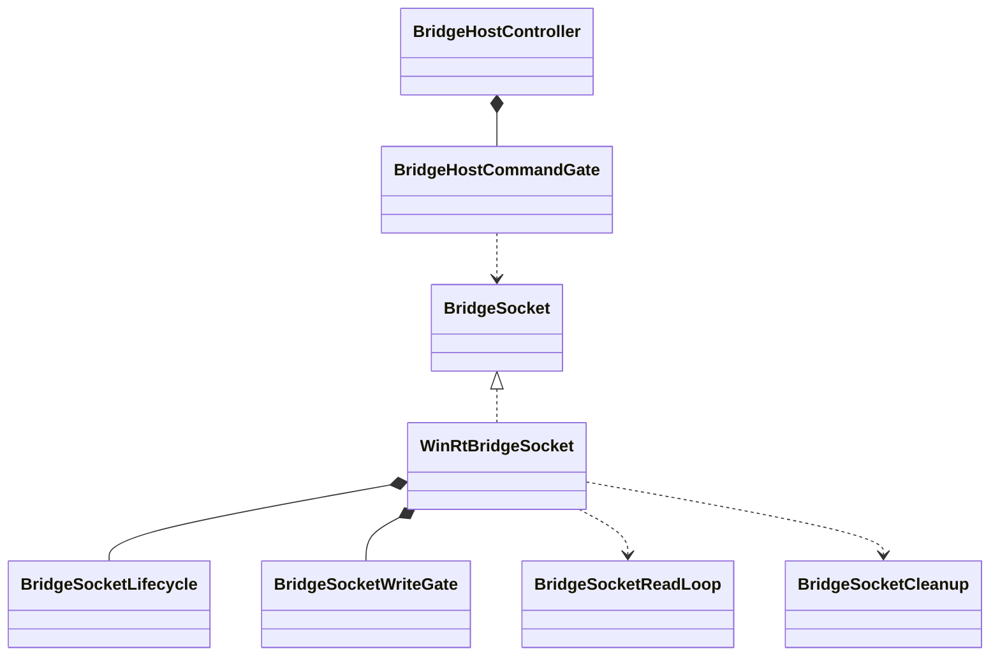

## 2. Object
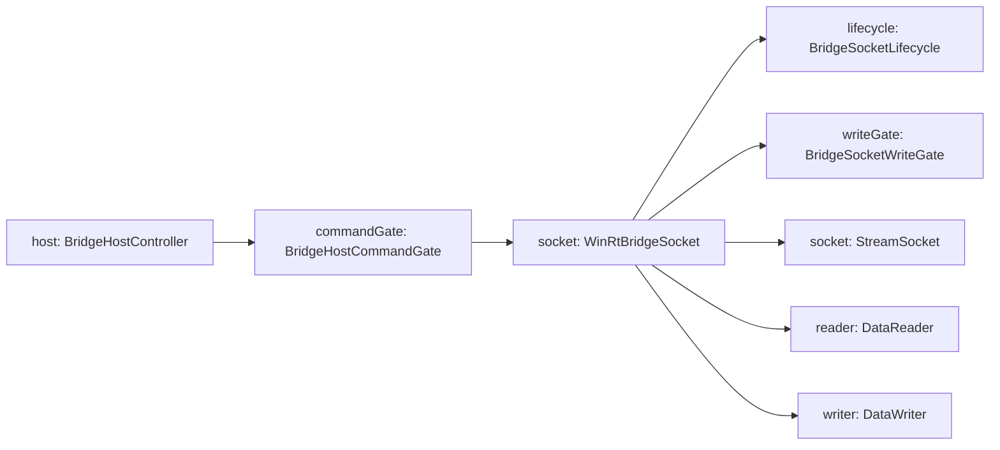

## 3. Component
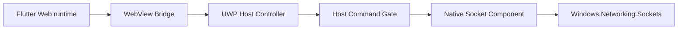

## 4. Composite Structure
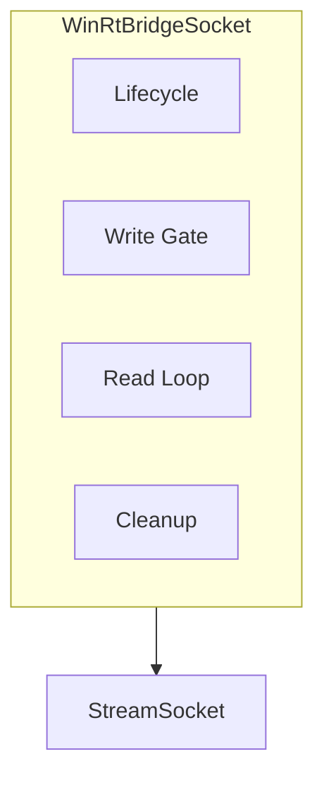

## 5. Package
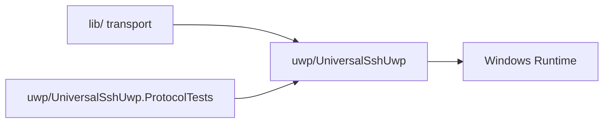

## 6. Deployment
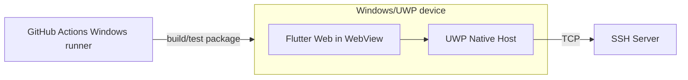

## 7. Profile
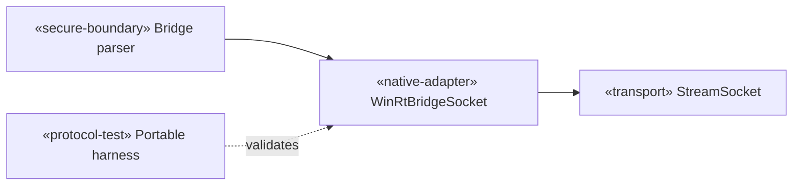

## 8. Use Case
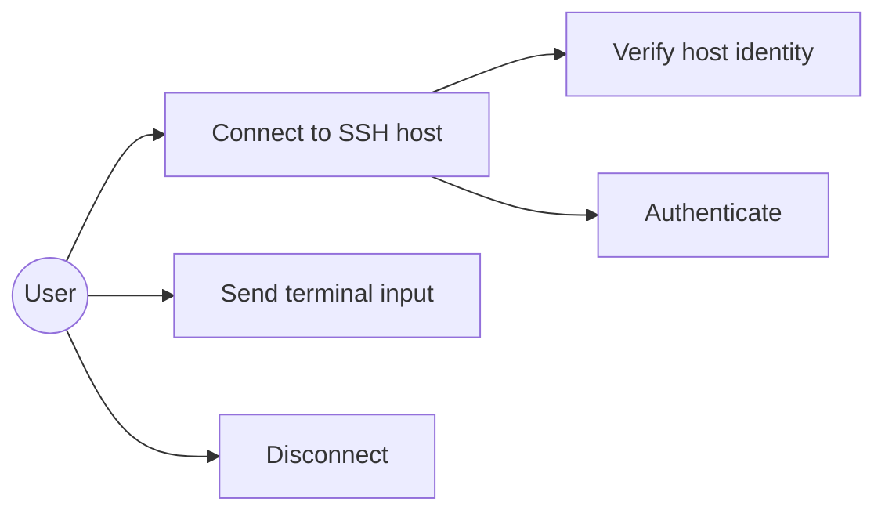

## 9. Activity
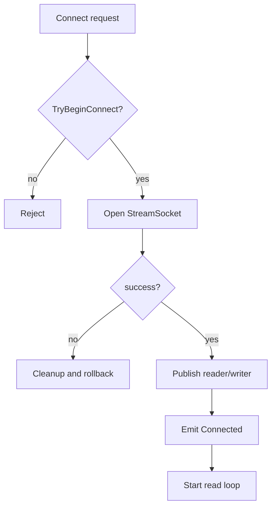

## 10. State Machine
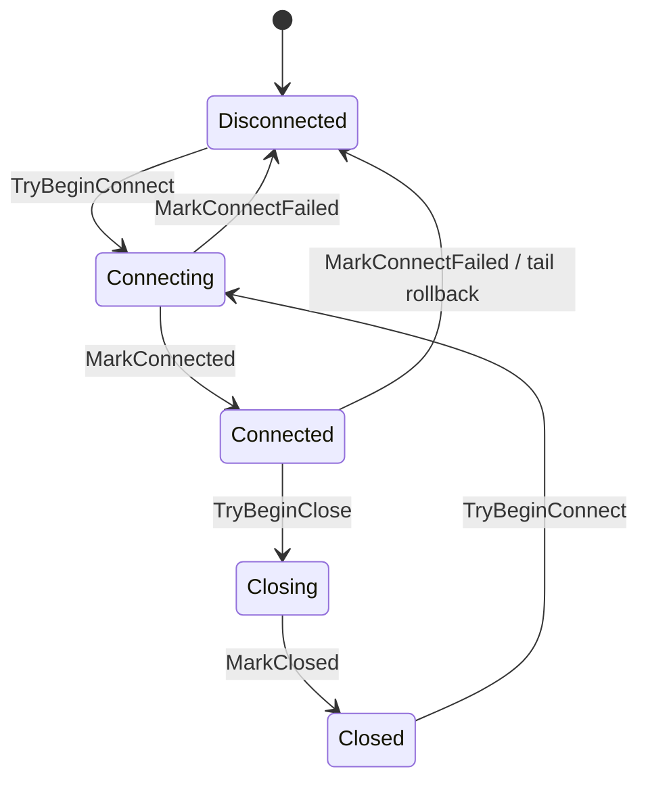

## 11. Sequence
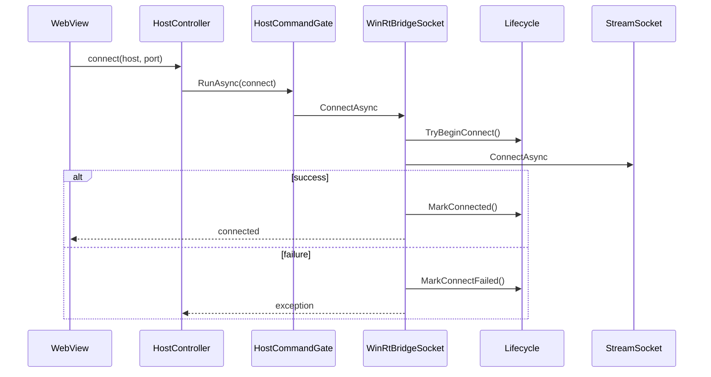

## 12. Communication
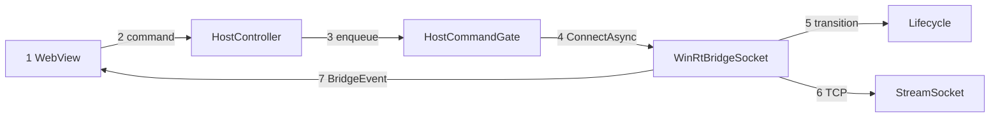

## 13. Interaction Overview
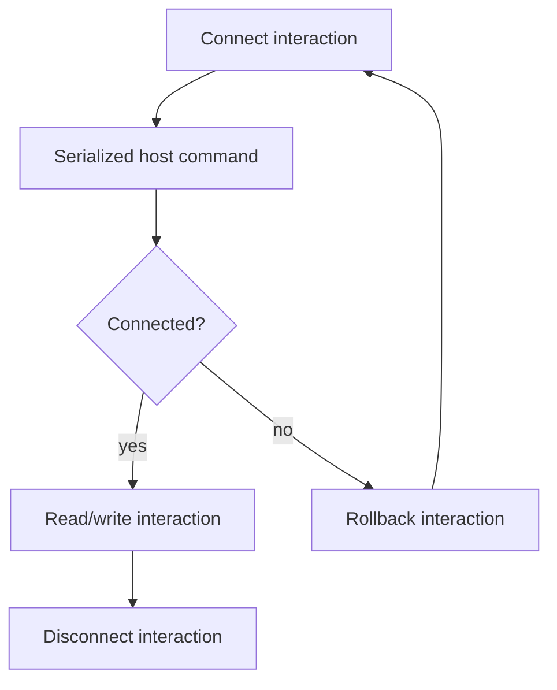

## 14. Timing
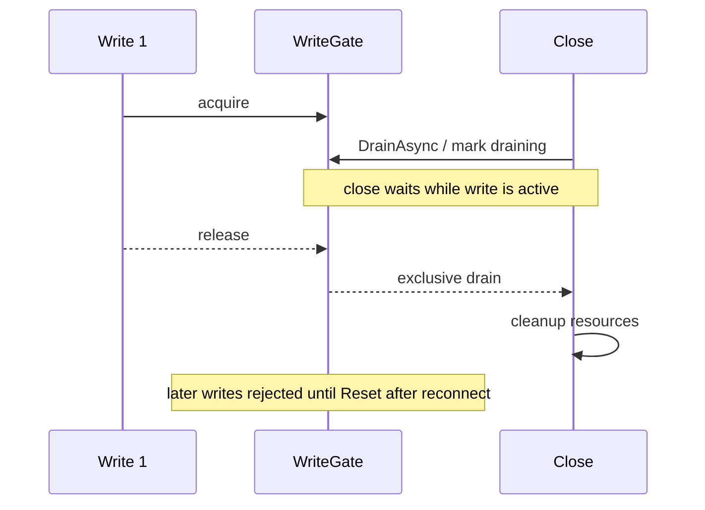
