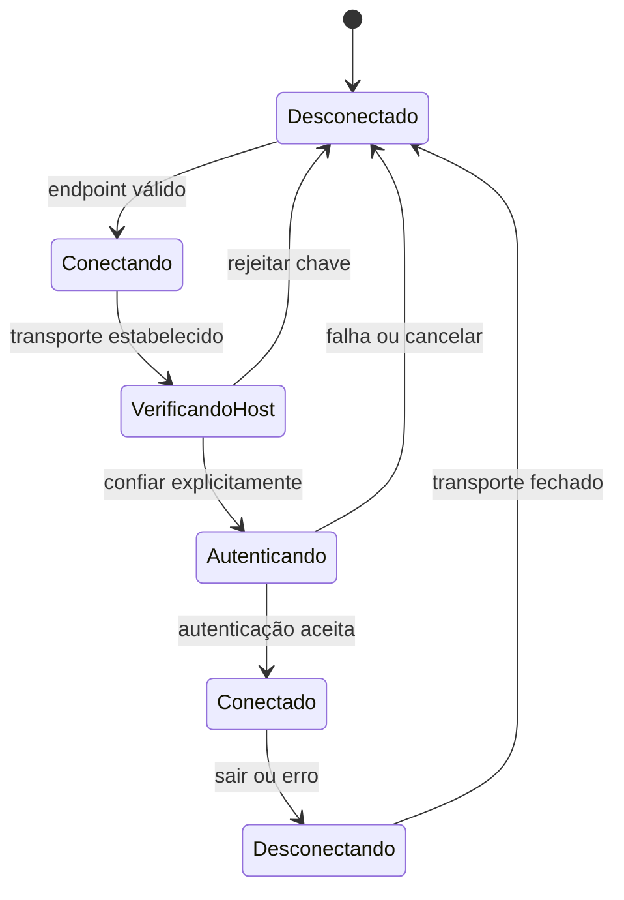

# Regras de negócio e comportamento por plataforma

## Finalidade

Estas regras definem o comportamento mínimo do cliente SSH e como validá-lo em Web/PWA, Android, Windows desktop, host UWP e Xbox. O modelo de negócio permanece em aberto até existir evidência de uso, conforme [issue #10](https://github.com/aloisiocosta-prof/universal-ssh/issues/10) e pesquisa da [issue #19](https://github.com/aloisiocosta-prof/universal-ssh/issues/19).

## Regras comuns do produto

| ID | Regra verificável |
| --- | --- |
| BR-01 | Uma conexão exige host não vazio, porta numérica entre 1 e 65535 e usuário não vazio. Dados inválidos impedem a tentativa e recebem mensagem compreensível. |
| BR-02 | Antes da autenticação, mostrar a impressão digital da host key. Nunca confiar automaticamente em host novo ou chave alterada. A rejeição encerra a tentativa; mudança de chave confiada exige alerta e nova decisão explícita. |
| BR-03 | Não registrar senhas, chaves privadas, conteúdo de entrada/saída do terminal ou tokens em logs, analytics, crash reports, URLs ou artefatos de CI. |
| BR-04 | A sessão não persiste credenciais por padrão. Ao desconectar, cancelar, expirar ou falhar, fechar o transporte, limpar segredos da memória que a aplicação controla e impedir eventos tardios de reabrirem a sessão. |
| BR-05 | Estados visíveis: desconectado, conectando, verificando host key, autenticando, conectado, erro e desconectando. Erros oferecem ação de recuperação sem ocultar a causa. |
| BR-06 | A entrada do terminal é encaminhada como bytes da sessão autenticada; a interface não executa comandos localmente nem transforma texto do terminal em ação no dispositivo cliente. |
| BR-07 | Exibir stdout e stderr como saída remota; preservar teclado e combinações de terminal relevantes (por exemplo, Ctrl+C, Ctrl+D e setas) durante a sessão. |
| BR-08 | Toda autorização de host e toda credencial se aplicam somente à sessão correspondente. Trocar host ou identidade reinicia validação e autenticação. |
| BR-09 | O modo demonstração nunca declara uma conexão real, host key real, autenticação bem-sucedida ou comando executado no servidor. Dados e resultados simulados devem permanecer visualmente identificados. |
| BR-10 | Nenhum modelo de receita, preço ou segmento será escolhido por regra técnica. Decisões de negócio dependem de pesquisa com usuários e evidência registrada. |

## Regras específicas por plataforma

### Web e PWA

- Navegadores não fornecem ao app Flutter acesso geral a sockets TCP. Uma conexão SSH real no browser precisa de um transporte compatível, normalmente WebSocket sobre TLS até um gateway/proxy SSH autorizado. A escolha de implantação, confiança e operação desse gateway é uma decisão pendente antes de prometer conexão Web real.
- O browser só envia conexão após o usuário informar o destino, confirmar a host key e autenticar. O gateway não pode aceitar destinos arbitrários sem controles que evitem abuso como proxy aberto.
- A PWA pode armazenar somente arquivos estáticos de interface no cache. Não armazenar credenciais, chaves, saída de terminal ou estado recuperável de sessão em Cache Storage, IndexedDB, localStorage ou URL.
- Offline: abrir a interface e comunicar indisponibilidade de rede. Nunca mostrar estado conectado ou comandos executados quando o transporte não existe.
- UI responsiva deve suportar teclado, toque, leitor de tela e foco visível. O terminal deve preservar atalhos remotos enquanto estiver focado sem aprisionar o foco de navegação.
- Base pública do GitHub Pages deve respeitar `/universal-ssh/`. Testar carregamento de `main.dart.js`, assets, recarga direta e instalação PWA no caminho de projeto.
- A interface desta PR é explicitamente uma simulação visual: não solicita senha, não abre socket e não executa comandos no host.

### Android

- Usar transporte nativo disponível na aplicação Flutter/Dart e permissões mínimas de rede. Rejeições, cancelamento e mudança de rede atualizam o estado da sessão.
- A primeira versão mantém credenciais somente durante a sessão. Se futuramente houver opção de lembrar credenciais, ela deve ser opt-in e usar armazenamento seguro fornecido pelo sistema operacional, com teste de remoção/revogação.
- UI deve suportar toque e teclado físico; o terminal captura combinações somente quando recebe foco.
- Validar com testes Flutter/Dart e execução em dispositivo ou emulador. A regressão Android não constitui evidência de validação comercial inicial nem de UWP.

### Windows desktop

- Reutilizar regras de conexão, host key, autenticação e terminal; usar API de rede e armazenamento seguro do Windows quando uma capability nativa for necessária.
- Para host Windows empacotado/UWP compatível, distribuir APPX/MSIX. Produzir MSI somente para host Win32 e instalador distintos; testar instalação, atualização e remoção desse produto separadamente.
- Suportar teclado e mouse; qualquer suporte a controle deve mapear ações semânticas e não alterar o conteúdo enviado ao servidor.
- Build x64 comprova compilação. Declarar uso funcional somente após testar instalação e sessão real no Windows desktop.

### Host UWP e WebView

- O host C#/WinRT fornece à WebView somente a bridge necessária ao transporte. A bridge deve aceitar comandos em formato versionado, validar campos, limites, estado e origem; rejeitar métodos e destinos fora da allowlist.
- Navegar apenas para assets locais do pacote (`ms-appx-web:///Web/index.html`) na sessão do cliente. Não conceder acesso de bridge a conteúdo remoto arbitrário.
- O host não executa comandos de shell locais. Recebe operações de transporte da sessão SSH e devolve eventos de rede; a implementação SSH continua responsável por criptografia, host key e autenticação.
- Cancelamento, timeout, fechamento da WebView, mudança de página e falha devem fechar o socket e descartar listeners/eventos da sessão.
- Testar contrato da bridge e ciclo de vida com testes nativos .NET/C#; validar pacote sem assinatura no CI e instalação assinada em ambiente Windows protegido antes de release público.

### Xbox

- O Xbox segue o contrato do host UWP, mas compatibilidade só pode ser afirmada após instalar e usar o pacote no console físico em Developer Mode.
- Validar conectividade para redes de teste autorizadas, dimensões de TV, legibilidade a distância, navegação por controle, teclado USB e comportamento de foco.
- Respeitar capacidades e restrições reais do console. Não inferir suporte a clipboard, armazenamento, sockets ou periféricos com base no Windows desktop.
- Builds UWP em runner Windows e testes de protocolo não substituem evidência no Xbox. Registrar modelo do console, modo, versão, periféricos, rede, SHA e resultado sanitizado na [issue #18](https://github.com/aloisiocosta-prof/universal-ssh/issues/18).

## Estados e fluxo

A simulação PWA pode ilustrar as transições, mas deve usar indicação persistente de DEMO e não afirmar que representa resultado de rede.

## Plano TDD por camada

1. **Dart/Flutter:** testes RED/GREEN para validação do endpoint, mudança de estado, confirmação/rejeição da chave, cancelamento e limpeza na desconexão. A UI de demo tem testes de widget para a jornada visível.
2. **Core SSH:** testes de unidade contra servidor local de teste para handshake, fingerprint, autenticação, stdout/stderr e encerramento; casos negativos para chave alterada e autenticação rejeitada.
3. **Web/PWA:** teste de navegador em viewport pequeno e grande, navegação por teclado, GitHub Pages sob `/universal-ssh/`, recarga, cache somente estático e ausência de armazenamento de segredos.
4. **Bridge UWP:** testes .NET para validação de origem, esquema e estado, concorrência, timeout e fechamento; teste integrado no WebView local.
5. **Android/Windows:** testes automatizados por plataforma e sessão real em dispositivos de validação.
6. **Xbox:** teste manual reproduzível em hardware real; registrar evidência separada. Nenhum teste simulado satisfaz esta etapa.

## Critérios de aceite da demo visual

- [ ] A tela se adapta a viewport estreito e largo e deixa claro que é uma demonstração.
- [ ] Host, porta e usuário válidos liberam o próximo passo; entrada inválida é bloqueada.
- [ ] Host key ilustrativa pode ser rejeitada ou aceita explicitamente.
- [ ] Autenticação simulada não pede segredo real.
- [ ] Terminal aceita apenas os comandos de demonstração documentados; nenhum texto chega à rede ou ao shell local.
- [ ] Desconectar retorna ao início e limpa a saída simulada.
- [ ] Testes de widget cobrem caminho aceito, rejeitado, comando demonstrativo e desconexão.
- [ ] Build Web carrega sob o caminho GitHub Pages do projeto.

## Critérios ainda fora da demo

Conexão SSH real, interoperabilidade com servidor, verificação criptográfica de host key, métodos de autenticação, persistência segura opcional, integração real com WebView/bridge, UX em dispositivos e pesquisa de negócio continuam dependentes das issues #11–#19.